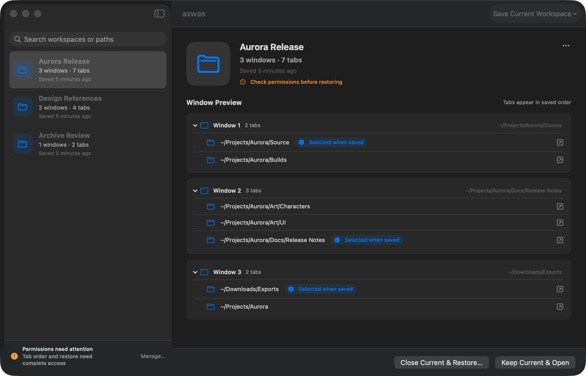

<div align="center">
  
  <h1>aswas</h1>
  <p><strong>Put your Finder workspace back exactly where you left it.</strong></p>
  <p>A native macOS menu bar companion for saving, closing, switching, and restoring groups of Finder windows.</p>

  <p>
    <a href="README.md">English</a> ·
    <a href="README.zh-CN.md">简体中文</a>
  </p>

  <p>
    
    
    <a href="https://github.com/x1phyr/aswas/actions/workflows/ci.yml"></a>
    <a href="LICENSE"></a>
  </p>
</div>

Finder windows are part of your working memory: the project folder, references, exports, and the places you need next. **aswas turns that arrangement into a named workspace**. Save it before changing context, close it without losing the setup, and restore it later from the menu bar.



> Real native macOS interface shown with sanitized demo workspace names and paths.

## Why aswas

<table>
  <tr>
    <td width="33%" valign="top"><strong>🧠 Preserve context</strong><br><br>Save readable Finder windows, folder locations, window bounds, view modes, and display placement as one workspace.</td>
    <td width="33%" valign="top"><strong>⚡ Switch cleanly</strong><br><br><em>Save &amp; Close</em> persists first and only then closes the exact windows that were captured—never every Finder window.</td>
    <td width="33%" valign="top"><strong>↩️ Restore safely</strong><br><br>Open alongside existing windows, or preview and confirm a Replace restore. Missing folders do not block the rest.</td>
  </tr>
</table>

## Highlights

- Native Swift 6 and SwiftUI menu bar app for macOS 14+
- Named workspace library with rename, update, restore, replace, and delete
- One-click **Restore Last Workspace** for rapid context switching
- Display-aware window placement with off-screen recovery
- Permission-gated Finder tab capture, ordering, selection, and restore
- Finder list, icon, column, and gallery view restoration where supported
- English, Simplified Chinese, and **Follow System** language modes
- Finder Automation permission guidance built into Settings
- Optional Launch at Login through Apple's `SMAppService`
- Atomic local JSON storage with backups and damaged-file isolation
- Privacy-aware logging with paths private in release builds

## Quick start

### Build from source

You need macOS 14 or later and Xcode 16 or later.

```sh
git clone https://github.com/x1phyr/aswas.git
cd aswas
swift test
./Scripts/build-app.sh
open build/Release/aswas.app
```

The build script creates an ad-hoc signed app bundle with Hardened Runtime enabled. For Developer ID signing and notarization, follow the [release guide](Docs/Release.md).

### First run

1. Open the app and find the aswas icon in the menu bar.
2. Choose **Save Current Workspace** while the Finder windows you want are open.
3. Approve Finder Automation when macOS asks.
4. To preserve Finder tab groups, open **Settings → Permissions** and grant Accessibility. Without it, single-tab Finder windows remain usable, but saving or updating stops when a multi-tab window is detected because its order cannot be verified safely.
5. Restore the workspace in **Open** mode, or use **Replace…** to preview and confirm which existing windows will close.

## How it protects your work

Saving and restoring Finder state touches real windows, so the destructive boundary is deliberately narrow:

- **Save & Close is save-first.** Capture, validation, and persistence must all succeed before any Finder window closes.
- **Only captured window IDs close.** aswas never sends a blanket `close every window` command.
- **Replace is explicit.** It previews readable windows and always requires confirmation.
- **Restore is resilient.** Missing or unreachable folders are skipped while valid folders continue.
- **Operations are serialized.** Repeated restore clicks cannot start competing restore jobs.
- **Your data stays local.** aswas has no account, analytics, sync service, or network requirement.

## Language and appearance

Open **Settings → General → Language** and choose:

- Follow System
- English
- 简体中文

The app updates immediately. Its interface uses native materials and follows your macOS light or dark appearance.

## Finder capability note

Finder's installed scripting dictionary exposes each Finder tab as a window-like entry, but does not expose the containing tab group. aswas currently groups candidate entries by shared bounds, then uses Accessibility tab titles and child order to reconstruct the visual group and selected tab. If reliable order is unavailable, a multi-tab save or update is rejected instead of persisting shuffled data; the previous workspace and current Finder windows remain unchanged.

This reconstruction is still best effort. Separate windows can share identical bounds, different folders can have the same Finder title, and tab restoration relies on Finder UI automation. Treat those cases as release-test boundaries rather than guaranteed behavior.

The verified baseline and the remaining edge cases are tracked in the [Finder capability matrix](Docs/FinderCapabilityMatrix.md) and [manual test plan](Docs/MVPManualTestPlan.md).

## Local data

Workspace data is stored as versioned JSON under:

```text
~/Library/Application Support/aswas/
├── workspaces/
├── backups/
└── corrupt/
```

Filenames use stable UUIDs rather than workspace names. Existing records are backed up before overwrite or delete, and a damaged record is isolated without preventing healthy workspaces from loading.

## Architecture

```text
SwiftUI menu bar app
        │
        ├── Application services ── capture / save / restore / close
        │
        ├── Domain model ─────────── versioned workspace snapshots
        │
        └── Infrastructure ───────── Finder AppleScript + atomic JSON repository
```

`AswasCore` keeps Finder integration, persistence, validation, migration, and restore policy independent from the UI. An isolated Finder capability PoC remains available for regression work:

```sh
swift run AswasFinderPoC dictionary
swift run AswasFinderPoC capture-native
swift run AswasFinderPoC capabilities-native
swift run AswasFinderPoC restore-native "$PWD" --allow-window-mutation
```

The mutation command creates and closes only its own test window.

## Development

```sh
swift build
swift test
swift run aswas
```

The test suite covers domain validation, migrations, capture mapping, safe close ordering, repository concurrency and recovery, display placement, restore serialization, and localization.

## Documentation

- [Complete Chinese user guide](Docs/UserGuide.zh-CN.md)
- [Architecture](Docs/Architecture.md)
- [Finder capability matrix](Docs/FinderCapabilityMatrix.md)
- [MVP manual test plan](Docs/MVPManualTestPlan.md)
- [Phase 1 capability PoC test plan](Docs/Phase1ManualTestPlan.md)
- [Release and notarization](Docs/Release.md)
- [Contributing](CONTRIBUTING.md)
- [Security policy](SECURITY.md)

## Roadmap

- Signed and notarized downloadable releases
- Keyboard shortcuts and faster workspace switching
- Optional workspace export and import
- Broader cross-version validation for Finder's Accessibility tab structure

Ideas and focused pull requests are welcome. Please read [CONTRIBUTING.md](CONTRIBUTING.md) before opening one.

## License

aswas is available under the [MIT License](LICENSE).
