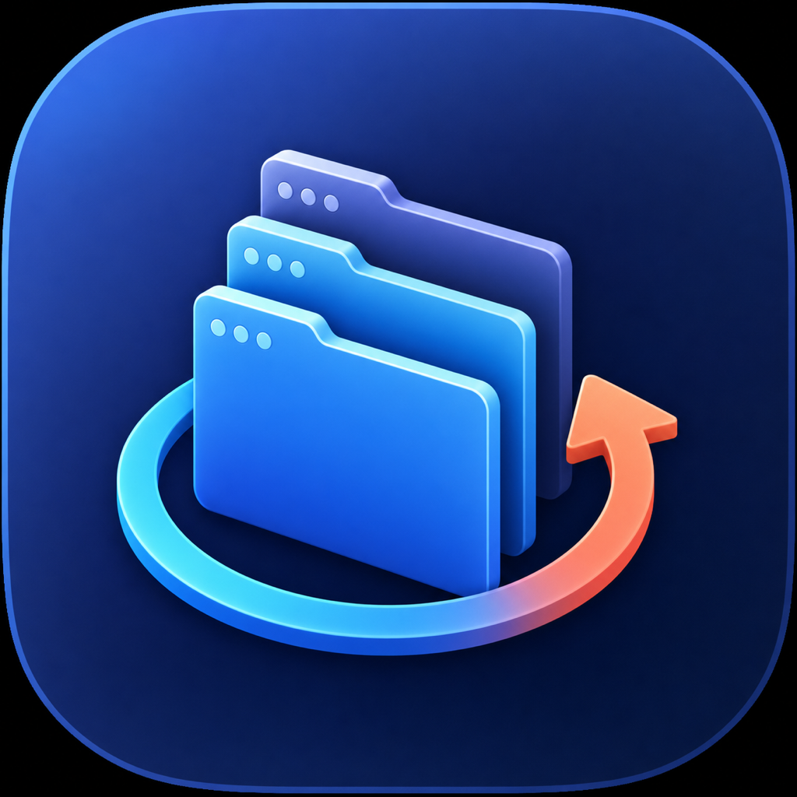
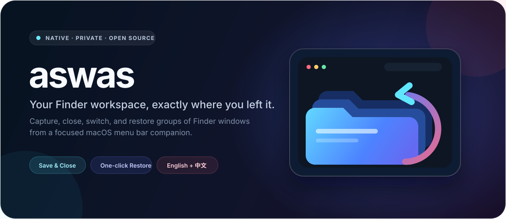
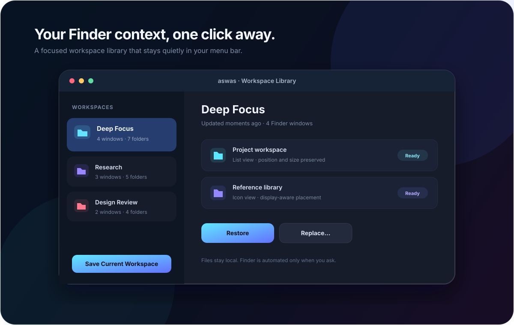

<div align="center">
  
  <h1>aswas</h1>
  <p><strong>让 Finder 工作区回到你离开时的位置。</strong></p>
  <p>一款原生 macOS 菜单栏工具，用来保存、关闭、切换和恢复成组的 Finder 窗口。</p>

  <p>
    <a href="README.md">English</a> ·
    <a href="README.zh-CN.md">简体中文</a>
  </p>

  <p>
    
    
    <a href="https://github.com/x1phyr/aswas/actions/workflows/ci.yml"></a>
    <a href="LICENSE"></a>
  </p>
</div>



Finder 窗口本就是工作记忆的一部分：项目目录、参考资料、导出位置，以及下一步要打开的地方。**aswas 会把这套排列保存成一个命名工作区**。切换任务前保存并关闭，之后从菜单栏一键恢复。



> 上图是产品展示插画。实际应用使用原生 SwiftUI 控件，并自动跟随当前 macOS 外观。

## 为什么选择 aswas

<table>
  <tr>
    <td width="33%" valign="top"><strong>🧠 保留上下文</strong><br><br>把可读取的 Finder 窗口、文件夹位置、窗口尺寸、视图模式和显示器位置保存为一个工作区。</td>
    <td width="33%" valign="top"><strong>⚡ 干净切换</strong><br><br>“保存并关闭”一定先完成持久化，再精确关闭已捕获的窗口；不会粗暴地关闭所有 Finder 窗口。</td>
    <td width="33%" valign="top"><strong>↩️ 安全恢复</strong><br><br>可在现有窗口旁打开，也可预览并确认“替换恢复”。个别文件夹缺失不会阻塞其余内容。</td>
  </tr>
</table>

## 功能亮点

- 基于 Swift 6 与 SwiftUI 的原生 macOS 14+ 菜单栏应用
- 工作区资料库：重命名、更新、恢复、替换和删除
- 一键“恢复上一个工作区”，快速找回工作上下文
- 感知显示器的窗口定位与屏幕外窗口纠正
- 在 Finder 支持的范围内恢复列表、图标、分栏和画廊视图
- 英文、简体中文，以及“跟随系统”语言模式
- 设置页内置 Finder 自动化权限指引
- 通过 Apple `SMAppService` 可选开机启动
- 原子化本地 JSON 存储、自动备份与损坏文件隔离
- 隐私友好的结构化日志；发布构建不会公开路径

## 快速开始

### 从源码构建

需要 macOS 14 或更高版本，以及 Xcode 16 或更高版本。

```sh
git clone https://github.com/x1phyr/aswas.git
cd aswas
swift test
./Scripts/build-app.sh
open build/Release/aswas.app
```

构建脚本会生成启用 Hardened Runtime 的临时签名应用包。如需 Developer ID 签名与公证，请参阅[发布指南](Docs/Release.md)。

### 首次使用

1. 打开应用，在菜单栏找到 aswas 图标。
2. 保留需要保存的 Finder 窗口，点击“保存当前工作区”。
3. macOS 弹出提示时允许 Finder 自动化。窗口级工作流不需要“辅助功能”权限。
4. 使用“打开”模式在现有窗口旁恢复；或选择“替换…”，预览并确认将关闭的现有窗口。

## 它如何保护你的工作

保存和恢复会操作真实窗口，因此 aswas 刻意把破坏性边界收得很窄：

- **“保存并关闭”一定先保存。** 捕获、校验与持久化全部成功后，才会关闭 Finder 窗口。
- **只关闭已捕获的窗口 ID。** 永远不会发送 `close every window` 这类全量命令。
- **替换操作必须明确确认。** 先展示可读取窗口的预览，再由用户确认。
- **局部失败不拖垮恢复。** 缺失或无法访问的文件夹会跳过，其余文件夹继续恢复。
- **恢复任务串行执行。** 连续点击不会启动互相竞争的恢复任务。
- **数据只留在本机。** 没有账号、统计分析、同步服务，也不依赖网络。

## 语言与外观

打开“**设置 → 通用 → 语言**”，可选择：

- 跟随系统
- English
- 简体中文

切换后界面会立即更新。应用使用原生材质，并跟随 macOS 的浅色或深色外观。

## Finder 能力说明

当前 macOS 中，Finder 已安装的公共脚本字典没有暴露标签页。aswas 因此会保存和恢复每个可读取 Finder 窗口的当前文件夹，并明确提示这是尽力恢复；项目**不会宣称支持完整标签页还原**。

该限制已记录并纳入回归测试，详见 [Finder 能力矩阵](Docs/FinderCapabilityMatrix.md)。

## 本地数据

工作区以带版本的 JSON 格式保存在：

```text
~/Library/Application Support/aswas/
├── workspaces/
├── backups/
└── corrupt/
```

文件名使用稳定 UUID，不使用用户输入的工作区名称。覆盖或删除前会自动备份；损坏记录会被隔离，不影响其他健康工作区加载。

## 架构

```text
SwiftUI 菜单栏应用
        │
        ├── 应用服务 ───── 捕获 / 保存 / 恢复 / 关闭
        │
        ├── 领域模型 ───── 带版本的工作区快照
        │
        └── 基础设施 ───── Finder AppleScript + 原子 JSON 仓库
```

`AswasCore` 将 Finder 集成、存储、校验、迁移和恢复策略与 UI 分离。仓库还保留了独立的 Finder 能力 PoC，方便回归验证：

```sh
swift run AswasFinderPoC dictionary
swift run AswasFinderPoC capture-native
swift run AswasFinderPoC capabilities-native
swift run AswasFinderPoC restore-native "$PWD" --allow-window-mutation
```

其中变更型命令只创建并关闭它自己的测试窗口。

## 开发

```sh
swift build
swift test
swift run aswas
```

测试覆盖领域校验、数据迁移、捕获映射、安全关闭顺序、仓库并发与恢复、显示器定位、恢复串行化以及本地化。

## 文档

- [架构说明](Docs/Architecture.md)
- [Finder 能力矩阵](Docs/FinderCapabilityMatrix.md)
- [MVP 手动测试计划](Docs/MVPManualTestPlan.md)
- [第一阶段能力 PoC 测试计划](Docs/Phase1ManualTestPlan.md)
- [发布与公证](Docs/Release.md)
- [参与贡献](CONTRIBUTING.md)
- [安全策略](SECURITY.md)

## 路线图

- 提供签名并公证的可下载版本
- 键盘快捷键与更快的工作区切换
- 可选的工作区导入与导出
- 如果 Apple 提供稳定公共标签页 API，进一步提升 Finder 还原精度

欢迎提交想法和边界清晰的 Pull Request。提交前请先阅读 [CONTRIBUTING.md](CONTRIBUTING.md)。

## 许可证

aswas 使用 [MIT License](LICENSE) 开源。
